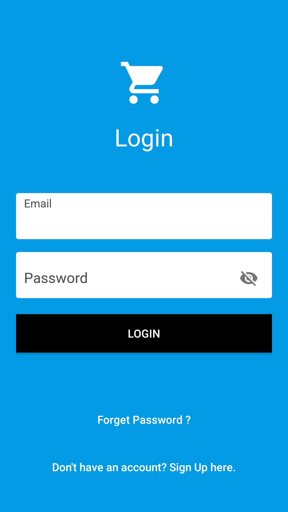
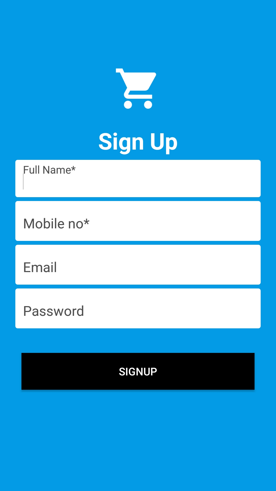
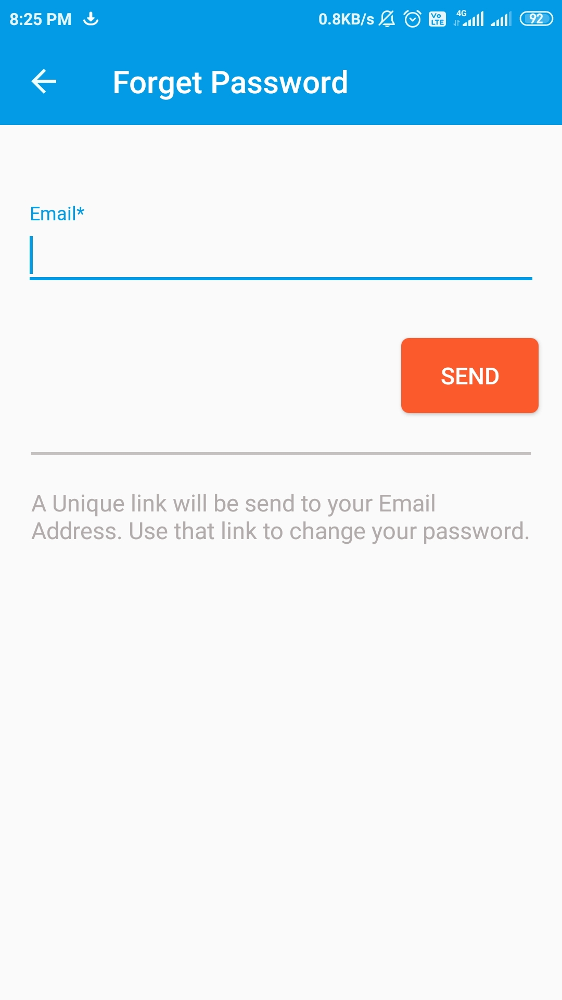
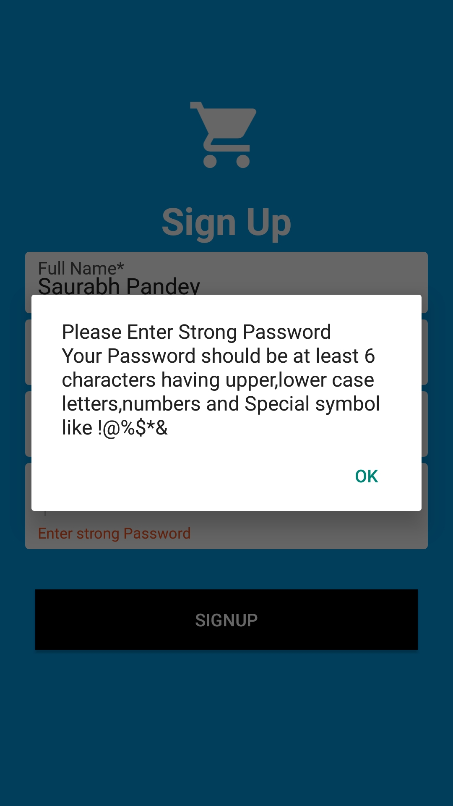

# Odd Jobs #

Odd Jobs is an Android based E-Commerce Application that can be used by buyer and seller to perform various activities related to purchasing and selling of goods.

## Features
* Simple and minimal Layout Designs.
* Interlinked Activities for different functions.
* Text Views ,Toasts,AlertDialog for displaying info.
* Buy now , Add cart buttons for hassle free purchase
* Updates using Push Notifications.
* Real-time Synchronization with Online Database.
* Auto Login on App launch if the customer/seller is logged in.
* Security Rules to protect the database from malicious activities.

## Functionalities
* Consumer Account:

    * Add new product to cart
    * Remove product form cart
    * Buy now button for direct purchase
    * Detailed View of product for All Secification of product
    * Keep adddress log
    * add or delete address
    * Set default address of shipping
    * Premium Account
    * Change / Forget Password option
    * Cash on delivery and Payment option (UPI Payment Gateway Added)
    * Transaction details
    * Order details
  
* Business Account :

  * Register for Business Account
  * Seller Info 
  * Company details & Company ID
  * Unique Product details
  * Seperate Product catalog for each type of products
  * Multiple option available to add new product for sail
  * Cash on deliver (COD) & Payment Option available for product purchase
  * Order details option added
  * Transaction details option added
  * Product details option added
  

## Security
* Email verification is added
* Login details and device id verification to avoid fraud and Spamming
* device block if unusual activity detected

# Screenshots #

## * Basic Layout

||||
|:---:|:---:|:---:|
|**SplashScreen**|**Login Page**|**Signup Page**|

||||
|:---:|:---:|:---:|
|**Forget/Change Password**|**Login Page**|**Signup Page**|

||||
|:---:|:---:|:---:|
|**User Home Page**|**Admin Home Page**|**Add Book Page**|

||||
|:---:|:---:|:---:|
|**Remove Book Page**|**Update Book Page**|**Issue Book Page**|

||||
|:---:|:---:|:---:|
|**Return Book Page**|**Reissue Book Page**|**Collect Fine Page**|

||||
|:---:|:---:|:---:|
|**Collect Fine Confirmation**|**Search Book Page**|**Search Book Results**|

||||
|:---:|:---:|:---:|
|**See Issued Books Page**|**User Reissue Book Page**|**New Book Added Notification**|

|||
|:---:|:---:|
|**Deadline Approaching Notification**|**Fine Increased Notification**|

## Tools Used
* [Android Studio](https://developer.android.com/studio) : Used as the Android developement environment.
* [Firebase Realtime Database](https://firebase.google.com/products/firestore) : Used as the backend database.
* [Firebase Storage](https://cloud.google.com/functions) : Use to store product Image
* [Firebase Authentication](https://firebase.google.com/products/cloud-messaging) : Used to manage User information

## Contributing
You are welcome to contribute :

1. [Fork it](https://github.com/saurabhpandey9/Odd-Jobs/fork)
2. Create new branch : `git checkout -b new_feature`
3. Commit your changes : `git commit -am 'Added new_feature'`
4. Push to the branch : `git push origin new_feature`
5. Submit a pull request !

## License
This Project is licensed under the MIT License, see the [LICENSE](LICENSE) file for details.

## Final Notes
**Thanks for going through this Repository! Have a nice day.** 
 **Saurabh Pandey**  
Contact me : saurabh17100@gmail.com